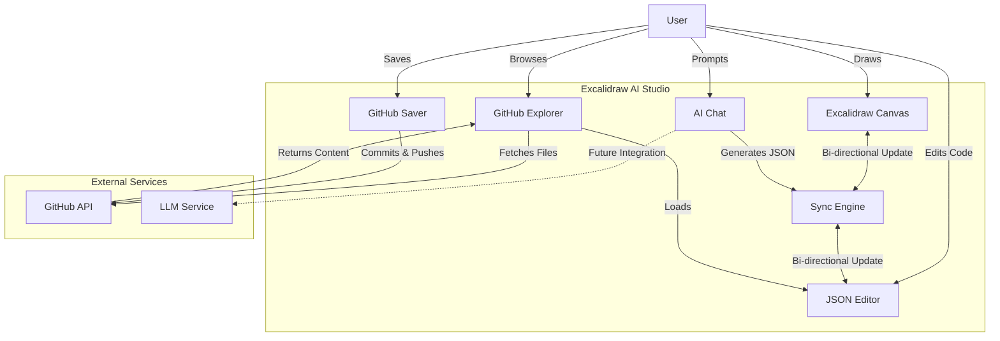
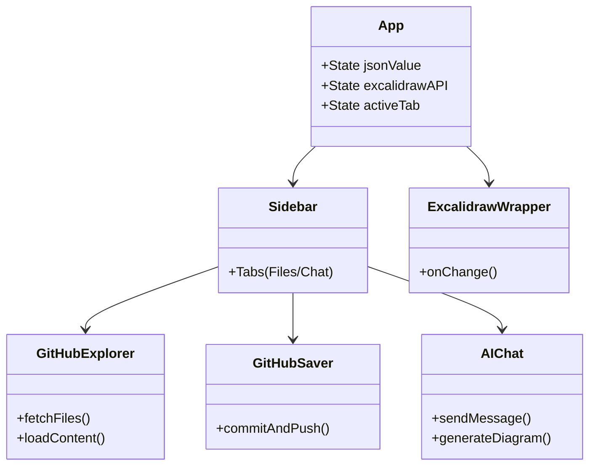

# Excalidraw AI Studio

**Excalidraw AI Studio** is a supercharged environment for creating, editing, and managing Excalidraw diagrams. It bridges the gap between visual creativity and code-based management, enhanced with AI capabilities and seamless GitHub integration.


*(Note: Replace with actual screenshot of the app)*

## 🚀 Key Features

-   **🎨 Full Excalidraw Experience**: Embedded full-featured Excalidraw editor.
-   **↔️ Bi-Directional Sync**: Real-time synchronization between the visual canvas and a raw JSON editor. Edit the code to change the drawing, or draw to update the code.
-   **📂 GitHub File Explorer**: Browse your GitHub repositories directly from the sidebar. Load `.excalidraw` and `.json` files instantly.
-   **💾 Save to GitHub**: Commit and push changes directly to your repository using a Personal Access Token (PAT). No more manual file uploads.
-   **🤖 AI Chat Integration**: Describe your diagram in plain English, and watch the AI generate it for you (Mock implementation currently).
-   **⚡ Productivity UI**: Collapsible sidebars, tabbed navigation, and a clean split-pane layout.

## 🛠 Architecture & Data Flow

### Application Flow


### Component Structure


## 🏁 Getting Started

### Prerequisites
-   Node.js (v18+)
-   A GitHub Account (for repo integration)

### Installation

1.  **Clone the repository**
    ```bash
    git clone https://github.com/neerajjain92/excalidraw-ai-studio.git
    cd excalidraw-ai-studio
    ```

2.  **Install dependencies**
    ```bash
    npm install
    ```

3.  **Run the development server**
    ```bash
    npm run dev
    ```

4.  Open [http://localhost:5173](http://localhost:5173) in your browser.

## 📖 Usage Guide

### GitHub Integration
1.  **Generate a Token**: Click the "(Generate)" link in the "Save to GitHub" section to create a GitHub Personal Access Token (PAT) with `repo` scope.
2.  **Load Files**: Enter your repository URL (e.g., `https://github.com/username/my-diagrams`) in the Explorer tab.
3.  **Save Changes**: Select a file, make edits, enter your PAT and a commit message, and click "Commit & Push".

### AI Chat
1.  Switch to the **AI Chat** tab.
2.  Click the **Settings (⚙️)** icon.
3.  Select your provider (**OpenAI** or **Anthropic**).
4.  Enter your **API Key**.
5.  (Optional) Specify a **Model** (e.g., `gpt-4o`, `claude-3-5-sonnet-latest`).
6.  Type a prompt (e.g., "Draw a system architecture") and click **Send**.

> **Note**: API keys are stored securely in your browser's `localStorage`.

### Proxy Setup (For Local Development)
To avoid CORS issues with the Anthropic API, this project uses a Vite proxy.
The proxy is configured in `vite.config.ts` to forward requests from `/api/anthropic` and `/api/openai` to their respective endpoints.
Ensure your development server is running (`npm run dev`) for the proxy to work.

## 🤝 Contributing

Contributions are welcome! Please feel free to submit a Pull Request.

## 📄 License

This project is licensed under the MIT License.
